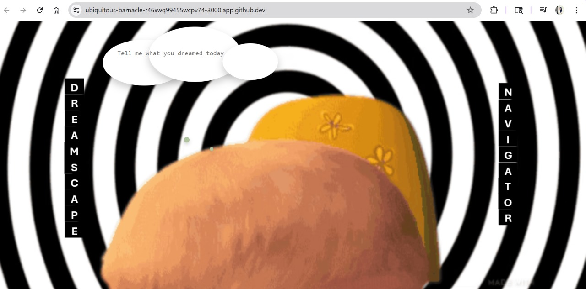

# Dream Decoder


> AI‐powered web app to interpret your dreams, turn them into poems, and visualize them as images.

---

## 📋 Table of Contents

1. [Features](#-features)  
2. [Demo](#-demo)  
3. [Tech Stack](#-tech-stack)  
4. [Project Structure](#-project-structure)  
5. [Getting Started](#-getting-started)  
   - [Prerequisites](#prerequisites)  
   - [Installation](#installation)  
   - [Running Locally](#running-locally)  
6. [Usage](#-usage)  
7. [API Endpoints](#-api-endpoints)  
8. [Running Tests](#-running-tests)  
9. [Environment Variables](#-environment-variables)  
10. [Contributing](#-contributing)  
11. [License](#-license)

---

## 🚀 Features

- **Dream Interpretation** – Natural‐language explanation via Perplexity Sonar API  
- **Poem Generation** – Transforms your dream text into a creative poem  
- **Image Visualization** – Generates a 16:9 dreamscape via Replicate models  
- **Interactive UI** – React + Vite frontend with smooth transitions  
- **FastAPI Backend** – Clean, RESTful endpoints for all modes  

---

## 📷 Demo



---

## 🛠 Tech Stack

- **Frontend:** React, TypeScript, Vite, Tailwind CSS  
- **Backend:** Python, FastAPI, Uvicorn  
- **APIs:** Perplexity Sonar, Replicate  
- **Testing:** pytest  

---

## 🗂 Project Structure

```
/
├── backend/                  # FastAPI server
│   ├── app.py               # Main API routes
│   ├── sonar_handler.py     # Sonar integration
│   ├── poem_generator.py    # Poem logic
│   ├── image_generator.py   # Image logic
│   ├── requirements.txt     # Python deps
│   ├── .env.example         # Sample env vars
│   └── tests/               # pytest tests
│       └── test_app.py
├── dream-decoder-ui/         # React/Vite frontend
│   ├── src/                 # Components & assets
│   ├── public/              # Static files
│   ├── package.json         # Node deps & scripts
│   └── tailwind.config.js   # Tailwind CSS config
├── LICENSE                  # MIT License
└── README.md                # This file
```

---

## 🏁 Getting Started

### Prerequisites

- **Node.js** v18+ & npm (or Yarn)  
- **Python** 3.12+ & pip  

### Installation

1. **Clone the repo**  
   ```bash
   git clone https://github.com/deepak-glitch/dream-decoder.git
   cd dream-decoder
   ```

2. **Backend setup**  
   ```bash
   cd backend
   cp .env.example .env
   pip install --upgrade pip
   pip install -r requirements.txt
   ```

3. **Frontend setup**  
   ```bash
   cd ../dream-decoder-ui
   npm install
   ```

### Running Locally

1. **Start the backend** (in `backend/`):  
   ```bash
   uvicorn app:app --reload --host 0.0.0.0 --port 8000
   ```
2. **Start the frontend** (in `dream-decoder-ui/`):  
   ```bash
   npm run dev
   ```
3. Open your browser at [http://localhost:3000](http://localhost:3000)

---

## 🎬 Usage

1. Enter your dream text and press **Enter**.  
2. Choose **Meaning**, **Poem**, or **Image**.  
3. Read the result or view the generated image.  
4. Click **← Back** to try a different mode.

---

## 🔌 API Endpoints

| Method | Endpoint      | Body                       | Response                     |
| ------ | ------------- | -------------------------- | ---------------------------- |
| POST   | `/interpret`  | `{ "dream_text": "..." }`  | `string` (interpretation)    |
| POST   | `/poem`       | `{ "dream_text": "..." }`  | `string` (poem)              |
| POST   | `/visualize`  | `{ "dream_text": "..." }`  | `{ "image_url": "https://…" }` |

---

## 🧪 Running Tests

_From the `backend/` folder:_
```bash
pytest
```

---

## 🔑 Environment Variables

Copy and edit the `.env` file in `backend/`:

```bash
cp .env.example .env
```

```dotenv
SONAR_API_KEY=your_perplexity_sonar_key
REPLICATE_API_TOKEN=your_replicate_token
```

---

## 🤝 Contributing

1. Fork the repo  
2. Create a branch: `git checkout -b feature/YourFeature`  
3. Commit: `git commit -m "feat: add YourFeature"`  
4. Push: `git push origin feature/YourFeature`  
5. Open a Pull Request

---

---
## 👥 Contributors

Thanks to all the people who have contributed to Dream Decoder:

- Deepak Mallampati – Project Lead and Backend Devolpment  
- Venkata Suma Priya Kankipati – Frontend Devlopment and Integration
---
  
## 📄 License

This project is licensed under the **MIT License**. See [LICENSE](LICENSE) for details.
